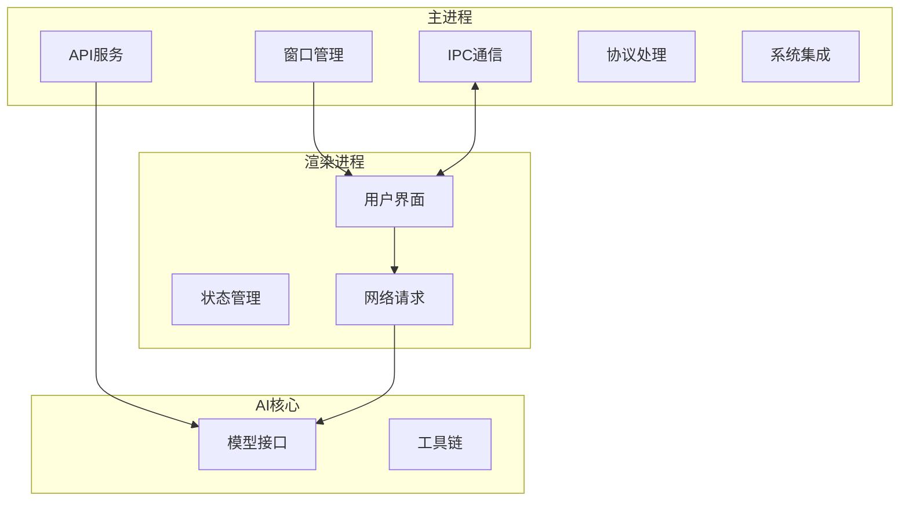
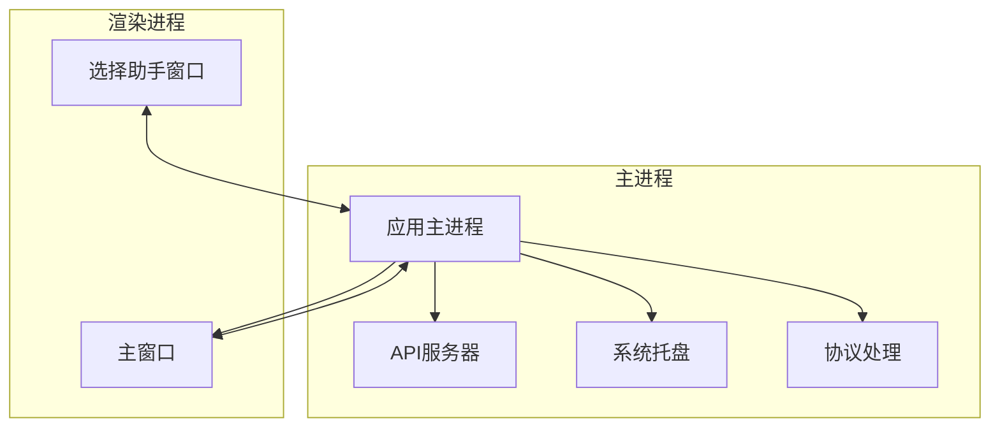
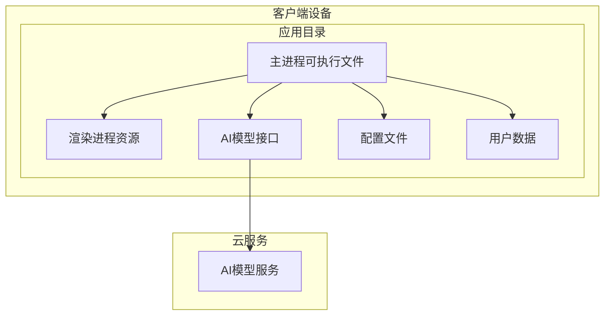

# Cherry Studio 项目架构分析

本文档基于 UML 4+1 视图模型对 Cherry Studio 项目进行架构分析。4+1 视图模型通过 5 个不同的视角来描述软件架构，包括逻辑视图、开发视图、进程视图、物理视图和场景视图。

## 1. 逻辑视图

逻辑视图主要关注系统的功能需求，展示系统中对象和类的静态结构以及它们之间的关系。

### 1.1 核心模块划分

Cherry Studio 采用模块化设计，主要包括以下核心模块：

- **主进程模块（Main Process）**：负责应用生命周期管理、窗口管理、系统集成等
- **渲染进程模块（Renderer Process）**：负责用户界面展示和交互
- **AI核心模块（aiCore）**：提供统一的 AI 模型接口
- **MCP跟踪模块（mcp-trace）**：处理模型上下文协议的跟踪功能
- **表格扩展模块（extension-table-plus）**：提供表格相关的扩展功能

### 1.2 主要组件关系



## 2. 开发视图

开发视图关注软件在开发环境中的结构，描述软件模块的组织和管理。

### 2.1 项目结构

```
cherry-studio/
├── src/
│   ├── main/           # Electron 主进程代码
│   ├── renderer/       # 渲染进程代码（前端界面）
│   └── preload/        # 预加载脚本
├── packages/           # yarn workspace 管理的子包
│   ├── aiCore/         # AI 核心模块
│   ├── mcp-trace/      # MCP 跟踪模块
│   ├── extension-table-plus/ # 表格扩展模块
│   └── shared/         # 共享模块
├── resources/          # 静态资源
├── docs/               # 文档
└── scripts/            # 构建和工具脚本
```

### 2.2 技术栈

- **前端框架**：React 19 + TypeScript
- **状态管理**：Redux + Redux Toolkit
- **构建工具**：Vite (electron-vite)
- **UI框架**：TailwindCSS + Ant Design
- **主进程框架**：Electron 37
- **AI SDK**：Vercel AI SDK 及其生态
- **数据库**：Drizzle ORM + libSQL
- **测试框架**：Vitest + Playwright

## 3. 进程视图

进程视图关注系统的运行时行为，描述进程、线程和相关对象的并发性。

### 3.1 进程架构

Cherry Studio 基于 Electron 构建，采用主进程-渲染进程架构：



### 3.2 并发处理

- **主进程**：负责应用生命周期、窗口管理、系统集成等核心功能
- **渲染进程**：负责UI渲染和用户交互，通过IPC与主进程通信
- **API服务器**：在独立线程中运行，提供本地API服务
- **AI处理**：通过aiCore模块异步处理AI请求

## 4. 物理视图

物理视图关注软件如何映射到硬件上，描述软件组件在物理层的分布。

### 4.1 部署架构

Cherry Studio 作为一个桌面应用程序，采用单机部署模式：



### 4.2 数据存储

- **本地配置**：存储在应用配置目录中
- **用户数据**：包括对话记录、助手配置等
- **AI模型**：支持本地模型（如Ollama）和云模型（如OpenAI、Anthropic）

## 5. 场景视图

场景视图是 4+1 视图的核心，通过用例和场景来描述架构如何满足功能需求。

### 5.1 启动场景

1. 应用启动时，主进程首先初始化
2. 主进程创建主窗口并加载渲染进程
3. 渲染进程初始化UI和状态管理
4. 主进程启动API服务器（如果启用）
5. 初始化系统托盘和协议处理

### 5.2 AI对话场景

1. 用户在UI中选择AI助手并输入问题
2. 渲染进程通过API模块发送请求
3. API模块调用aiCore中的对应模型接口
4. aiCore根据配置选择合适的AI服务提供商
5. 请求发送到云服务或本地模型
6. 响应逐块返回并显示在UI中

### 5.3 文件处理场景

1. 用户拖拽文件到应用中
2. 主进程处理文件读取和解析
3. 根据文件类型使用相应的解析器
4. 解析后的内容可用于AI处理
5. 处理结果返回给用户

## 6. 架构特点

### 6.1 模块化设计

采用 Yarn Workspaces 管理多个子包，实现功能解耦和复用：
- aiCore 提供统一的 AI 接口抽象
- mcp-trace 处理模型上下文跟踪
- extension-table-plus 提供表格扩展功能

### 6.2 插件化架构

支持通过 MCP（Model Context Protocol）扩展功能，便于集成各种 AI 服务和工具。

### 6.3 跨平台支持

基于 Electron 实现，支持 Windows、macOS 和 Linux 三大平台。

### 6.4 多模型支持

通过 aiCore 模块统一管理各种 AI 模型提供商，包括：
- 云服务：OpenAI、Anthropic、Google 等
- 本地模型：Ollama、LM Studio 等
- 网页AI服务：Claude、Perplexity、Poe 等