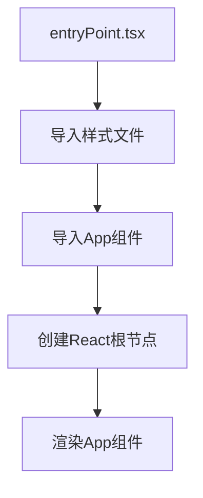
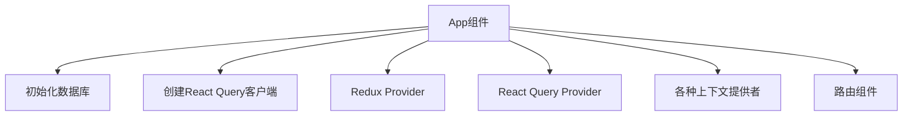
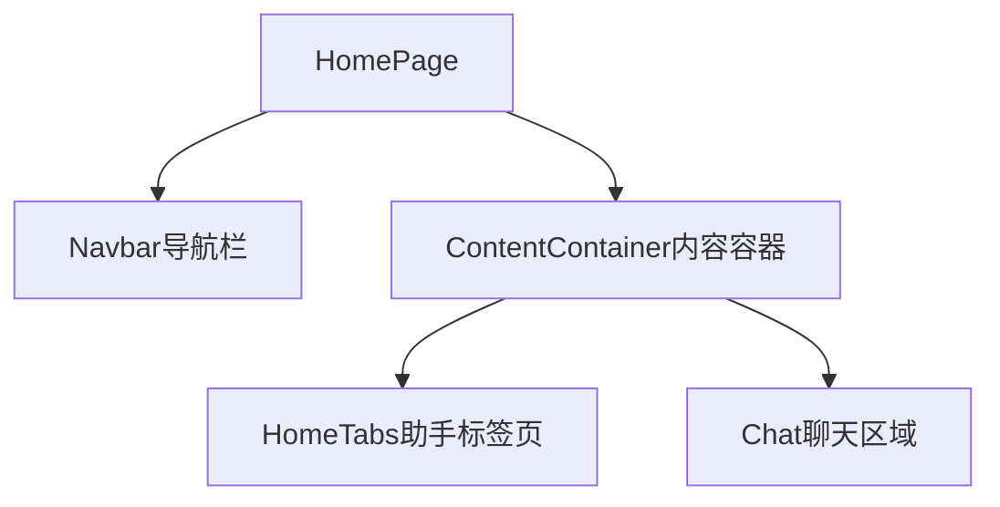
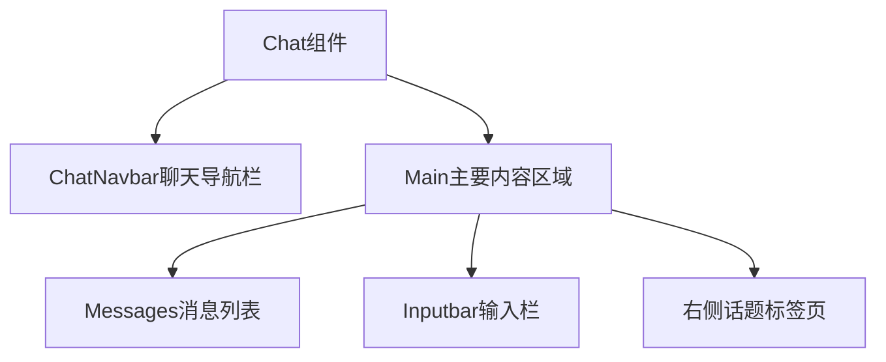
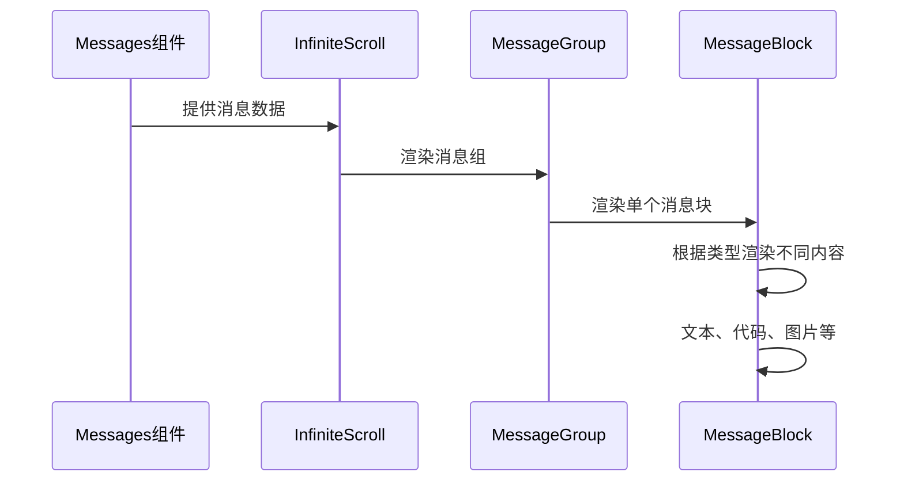
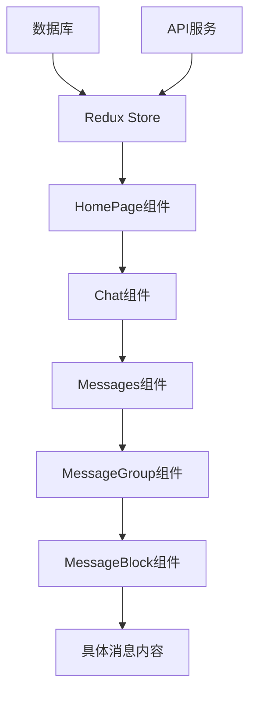

# Cherry Studio 主界面内容显示分析

本文档详细分析从 [App.tsx](../../../src/renderer/src/App.tsx) 入口点开始，到主界面内容完成显示的完整过程。

## 1. 应用启动入口

应用的入口点是 [entryPoint.tsx](../../../src/renderer/src/entryPoint.tsx) 文件，它负责挂载 React 应用到 DOM 中：

```typescript
import './assets/styles/index.css'
import './assets/styles/tailwind.css'
import '@ant-design/v5-patch-for-react-19'

import { createRoot } from 'react-dom/client'

import App from './App'

const root = createRoot(document.getElementById('root') as HTMLElement)
root.render(<App />)
```

在挂载 [App](../../../src/renderer/src/App.tsx#L27-L59) 组件之前，会先执行 [init.ts](../../../src/renderer/src/init.ts) 中的初始化逻辑：



## 2. App 根组件初始化

[App.tsx](../../../src/renderer/src/App.tsx) 是整个应用的根组件，负责初始化各种全局服务和上下文提供者：



### 2.1 数据库初始化

在 App 组件导入时，会首先导入数据库模块：

```typescript
import '@renderer/databases'
```

这会触发 [databases/index.ts](../../../src/renderer/src/databases/index.ts) 中的代码执行，初始化 Dexie 数据库实例并定义数据表结构。

### 2.2 Redux 状态管理

App 组件使用 Redux 进行状态管理：

```typescript
<Provider store={store}>
  <QueryClientProvider client={queryClient}>
    // ... 其他组件
  </QueryClientProvider>
</Provider>
```

其中 [store](../../../src/renderer/src/store/index.ts#L49-L74) 包含了应用的所有状态，包括助手、设置、运行时状态等。

### 2.3 上下文提供者

App 组件还提供了多个上下文提供者：

- [HeroUIProvider](../../../src/renderer/src/context/HeroUIProvider.tsx#L27-L31) - Hero UI 组件库的上下文
- [StyleSheetManager](../../../src/renderer/src/context/StyleSheetManager.tsx#L16-L22) - 样式表管理器
- [ThemeProvider](../../../src/renderer/src/context/ThemeProvider.tsx#L51-L110) - 主题管理
- [AntdProvider](../../../src/renderer/src/context/AntdProvider.tsx#L11-L31) - Ant Design 组件库配置
- [NotificationProvider](../../../src/renderer/src/context/NotificationProvider.tsx#L21-L26) - 通知系统
- [CodeStyleProvider](../../../src/renderer/src/context/CodeStyleProvider.tsx#L9-L14) - 代码样式管理

### 2.4 路由系统

通过 [Router](../../../src/renderer/src/Router.tsx#L28-L65) 组件管理应用路由：

```typescript
<Router />
```

## 3. 路由系统

[Router.tsx](../../../src/renderer/src/Router.tsx) 定义了应用的路由配置：

```typescript
<HashRouter>
  <NavigationHandler />
  <TabsContainer>{routes}</TabsContainer>
</HashRouter>
```

或者当导航栏在左侧时：

```typescript
<HashRouter>
  <Sidebar />
  {routes}
  <NavigationHandler />
</HashRouter>
```

路由配置包含以下页面：

- `/` - 主页 ([HomePage](../../../src/renderer/src/pages/home/HomePage.tsx#L17-L186))
- `/store` - 助手商店 ([AssistantPresetsPage](../../../src/renderer/src/pages/store/assistants/presets/AssistantPresetsPage.tsx#L28-L85))
- `/paintings/*` - 绘画页面 ([PaintingsRoutePage](../../../src/renderer/src/pages/paintings/PaintingsRoutePage.tsx#L11-L47))
- `/translate` - 翻译页面 ([TranslatePage](../../../src/renderer/src/pages/translate/TranslatePage.tsx#L22-L100))
- `/files` - 文件页面 ([FilesPage](../../../src/renderer/src/pages/files/FilesPage.tsx#L17-L110))
- `/notes` - 笔记页面 ([NotesPage](../../../src/renderer/src/pages/notes/NotesPage.tsx#L16-L102))
- `/knowledge` - 知识库页面 ([KnowledgePage](../../../src/renderer/src/pages/knowledge/KnowledgePage.tsx#L16-L60))
- `/apps/:appId` - 小程序页面 ([MinAppPage](../../../src/renderer/src/pages/minapps/MinAppPage.tsx#L22-L177))
- `/apps` - 小程序列表页面 ([MinAppsPage](../../../src/renderer/src/pages/minapps/MinAppsPage.tsx#L15-L54))
- `/code` - 代码工具页面 ([CodeToolsPage](../../../src/renderer/src/pages/code/CodeToolsPage.tsx#L12-L50))
- `/settings/*` - 设置页面 ([SettingsPage](../../../src/renderer/src/pages/settings/SettingsPage.tsx#L22-L120))
- `/launchpad` - 启动台页面 ([LaunchpadPage](../../../src/renderer/src/pages/launchpad/LaunchpadPage.tsx#L10-L22))

## 4. 主页内容显示

当用户访问根路径 `/` 时，会渲染 [HomePage](../../../src/renderer/src/pages/home/HomePage.tsx#L17-L186) 组件。

### 4.1 HomePage 组件结构

[HomePage](../../../src/renderer/src/pages/home/HomePage.tsx#L17-L186) 组件的结构如下：



### 4.2 助手和话题状态管理

HomePage 使用以下 hooks 管理状态：

- `useAssistants()` - 获取助手列表
- `useActiveTopic()` - 管理当前活动话题
- `useSettings()` - 获取应用设置

```typescript
const { assistants } = useAssistants()
const { activeTopic, setActiveTopic } = useActiveTopic(activeAssistant?.id, state?.topic)
const { showAssistants, showTopics, topicPosition } = useSettings()
```

### 4.3 Chat 组件

[Chat](../../../src/renderer/src/pages/home/Chat.tsx#L34-L304) 组件是主页的核心，负责显示聊天界面：



### 4.4 Messages 组件

[Messages](../../../src/renderer/src/pages/home/Messages/Messages.tsx#L36-L394) 组件负责显示消息列表：

```typescript
<Messages
  key={props.activeTopic.id}
  assistant={assistant}
  topic={props.activeTopic}
  setActiveTopic={props.setActiveTopic}
  onComponentUpdate={messagesComponentUpdateHandler}
  onFirstUpdate={messagesComponentFirstUpdateHandler}
/>
```

Messages 组件使用了以下技术：

1. **InfiniteScroll** - 实现无限滚动加载历史消息
2. **MessageGroup** - 将连续的用户/助手消息分组显示
3. **虚拟滚动** - 提高大量消息时的性能

### 4.5 消息渲染流程

消息渲染的具体流程如下：



## 5. 界面渲染优化

### 5.1 虚拟滚动

对于大量消息的场景，使用了虚拟滚动技术来优化性能：

```typescript
<InfiniteScroll
  dataLength={displayMessages.length}
  next={loadMore}
  hasMore={hasMore}
  loader={<LoadingSpinner />}
  scrollableTarget="messages"
>
  // 消息内容
</InfiniteScroll>
```

### 5.2 动画效果

使用 Framer Motion 实现界面动画：

```typescript
<motion.div
  initial={{ width: 0, opacity: 0 }}
  animate={{ width: 'var(--assistants-width)', opacity: 1 }}
  exit={{ width: 0, opacity: 0 }}
  transition={{ duration: 0.3, ease: 'easeInOut' }}
>
```

### 5.3 懒加载

部分组件采用懒加载方式，提高初始加载速度：

```typescript
const AssistantPresetsPage = lazy(() => import('@renderer/pages/store/assistants/presets/AssistantPresetsPage'))
```

## 6. 数据流

整个主界面的数据流如下：



## 7. 总结

从 [App.tsx](../../../src/renderer/src/App.tsx) 到主界面完全显示的过程涉及多个层次：

1. **应用初始化** - 包括数据库、状态管理、上下文提供者等
2. **路由匹配** - 根据 URL 路径渲染对应页面组件
3. **主页渲染** - 加载助手、话题数据并显示聊天界面
4. **消息显示** - 从数据库加载消息并通过虚拟滚动显示
5. **交互处理** - 处理用户输入、消息发送等操作

整个过程采用了现代化的 React 开发模式，包括 Hooks、Context、Redux 状态管理、懒加载、虚拟滚动等技术，确保了良好的用户体验和性能表现。
