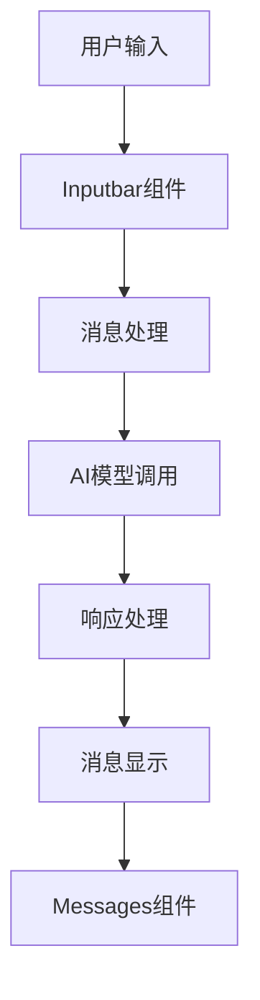
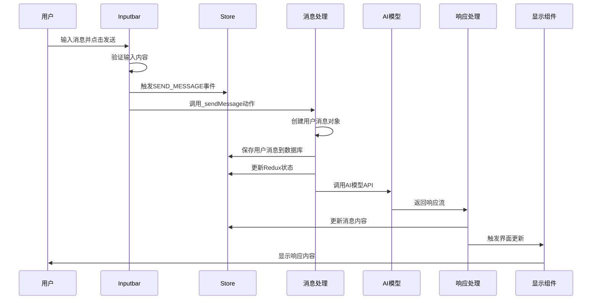

# Cherry Studio 对话功能实现分析

本文档详细分析 Cherry Studio 中对话功能的实现机制，包括从用户输入到消息显示的完整流程。

## 1. 功能概述

对话功能是 Cherry Studio 的核心功能，允许用户与 AI 助手进行交互式对话。该功能包括消息输入、发送、处理和显示等环节，支持文本、文件等多种消息类型。

## 2. 整体架构

对话功能的实现涉及多个组件和模块的协作：



## 3. 核心组件

### 3.1 Inputbar 组件

Inputbar 是用户输入消息的主要界面，位于聊天窗口底部。

#### 主要功能：
- 文本输入
- 文件附件
- 模型选择
- 消息发送
- 快捷键支持

#### 核心实现逻辑：

```typescript
const sendMessage = useCallback(async () => {
  if (inputEmpty) {
    return
  }
  if (checkRateLimit(assistant)) {
    return
  }

  logger.info('Starting to send message')

  const parent = spanManagerService.startTrace(
    { topicId: topic.id, name: 'sendMessage', inputs: text },
    mentionedModels && mentionedModels.length > 0 ? mentionedModels : [assistant.model]
  )
  EventEmitter.emit(EVENT_NAMES.SEND_MESSAGE, { topicId: topic.id, traceId: parent?.spanContext().traceId })

  try {
    // Dispatch the sendMessage action with all options
    const uploadedFiles = await FileManager.uploadFiles(files)

    const baseUserMessage: MessageInputBaseParams = { assistant, topic, content: text }

    // getUserMessage()
    if (uploadedFiles) {
      baseUserMessage.files = uploadedFiles
    }

    if (mentionedModels) {
      baseUserMessage.mentions = mentionedModels
    }

    baseUserMessage.usage = await estimateUserPromptUsage(baseUserMessage)

    const { message, blocks } = getUserMessage(baseUserMessage)
    message.traceId = parent?.spanContext().traceId

    dispatch(_sendMessage(message, blocks, assistant, topic.id))

    // Clear input
    setText('')
    setFiles([])
    setTimeoutTimer('sendMessage_1', () => setText(''), 500)
    setTimeoutTimer('sendMessage_2', () => resizeTextArea(true), 0)
    setExpand(false)
  } catch (error) {
    logger.warn('Failed to send message:', error as Error)
    parent?.recordException(error as Error)
  }
}, [assistant, dispatch, files, inputEmpty, mentionedModels, resizeTextArea, setTimeoutTimer, text, topic])
```

### 3.2 消息发送流程

消息发送流程是对话功能的核心，涉及多个步骤：



### 3.3 sendMessage Thunk 实现

消息发送的核心逻辑通过 Redux Thunk 实现：

```typescript
export const sendMessage =
  (
    userMessage: Message,
    userMessageBlocks: MessageBlock[],
    assistant: Assistant,
    topicId: Topic['id'],
    agentSession?: AgentSessionContext
  ) =>
  async (dispatch: AppDispatch, getState: () => RootState) => {
    try {
      if (userMessage.blocks.length === 0) {
        logger.warn('sendMessage: No blocks in the provided message.')
        return
      }

      const stateBeforeSend = getState()
      let activeAgentSession = agentSession ?? findExistingAgentSessionContext(stateBeforeSend, topicId, assistant.id)
      if (activeAgentSession) {
        const derivedSession = findExistingAgentSessionContext(stateBeforeSend, topicId, assistant.id)
        if (derivedSession?.agentSessionId && derivedSession.agentSessionId !== activeAgentSession.agentSessionId) {
          activeAgentSession = { ...activeAgentSession, agentSessionId: derivedSession.agentSessionId }
        }
      }
      if (activeAgentSession?.agentSessionId && !userMessage.agentSessionId) {
        userMessage.agentSessionId = activeAgentSession.agentSessionId
      }

      await saveMessageAndBlocksToDB(userMessage, userMessageBlocks)
      dispatch(newMessagesActions.addMessage({ topicId, message: userMessage }))
      if (userMessageBlocks.length > 0) {
        dispatch(upsertManyBlocks(userMessageBlocks))
      }
      dispatch(updateTopicUpdatedAt({ topicId }))

      const queue = getTopicQueue(topicId)

      if (activeAgentSession) {
        const assistantMessage = createAssistantMessage(assistant.id, topicId, {
          askId: userMessage.id,
          model: assistant.model,
          traceId: userMessage.traceId
        })
        if (activeAgentSession.agentSessionId && !assistantMessage.agentSessionId) {
          assistantMessage.agentSessionId = activeAgentSession.agentSessionId
        }
        await saveMessageAndBlocksToDB(assistantMessage, [])
        dispatch(newMessagesActions.addMessage({ topicId, message: assistantMessage }))

        queue.add(async () => {
          await fetchAndProcessAgentResponseImpl(dispatch, getState, {
            topicId,
            assistant,
            assistantMessage,
            agentSession: activeAgentSession,
            userMessageId: userMessage.id
          })
        })
      } else {
        const mentionedModels = userMessage.mentions

        if (mentionedModels && mentionedModels.length > 0) {
          await dispatchMultiModelResponses(dispatch, getState, topicId, userMessage, assistant, mentionedModels)
        } else {
          const assistantMessage = createAssistantMessage(assistant.id, topicId, {
            askId: userMessage.id,
            model: assistant.model,
            traceId: userMessage.traceId
          })
          await saveMessageAndBlocksToDB(assistantMessage, [])
          dispatch(newMessagesActions.addMessage({ topicId, message: assistantMessage }))

          queue.add(async () => {
            await fetchAndProcessAssistantResponseImpl(dispatch, getState, topicId, assistant, assistantMessage)
          })
        }
      }
    } catch (error) {
      logger.error('Error in sendMessage thunk:', error as Error)
    } finally {
      finishTopicLoading(topicId)
    }
  }
```

## 4. 消息数据结构

### 4.1 Message 结构

```typescript
interface Message {
  id: string
  role: 'user' | 'assistant' | 'system'
  topicId: string
  assistantId: string
  createdAt: string
  status: string
  modelId?: string
  model?: Model
  type?: string
  useful?: boolean
  askId?: string
  mentions?: Model[]
  enabledMCPs?: string[]
  usage?: Usage
  metrics?: Metrics
  multiModelMessageStyle?: string
  foldSelected?: boolean
  blocks: string[] // 消息块ID列表
}
```

### 4.2 MessageBlock 结构

消息内容通过 MessageBlock 进行组织：

```typescript
interface MessageBlock {
  id: string
  messageId: string
  type: MessageBlockType
  content?: string
  status: MessageBlockStatus
  createdAt: string
  updatedAt?: string
  metadata?: any
}
```

## 5. 消息发送与处理流程详解

### 5.1 消息发送阶段

当用户在 Inputbar 中输入消息并点击发送按钮后，系统会执行以下步骤：

1. **输入验证**：检查输入内容是否为空，以及是否超过速率限制
2. **文件上传**：如果用户附加了文件，则通过 `FileManager.uploadFiles` 上传这些文件
3. **消息构建**：使用 `getUserMessage` 函数创建用户消息对象和相关消息块
4. **状态追踪**：使用 `spanManagerService` 创建追踪上下文，用于性能监控
5. **事件触发**：发出 `SEND_MESSAGE` 事件通知其他组件
6. **状态更新**：调用 `_sendMessage` thunk 更新 Redux 状态并保存消息到数据库

这一流程在 Inputbar 组件的 [sendMessage](../../../src/renderer/src/pages/home/Inputbar/Inputbar.tsx#L215-L280) 函数中实现。

### 5.2 消息处理阶段

消息处理阶段由 `sendMessage` thunk 函数驱动，其核心逻辑如下：

1. **会话检查**：检查是否存在活动的代理会话，如果有则进行相应处理
2. **多模型处理**：检查用户消息中是否提及了多个模型，如果是则调用 `dispatchMultiModelResponses` 处理
3. **普通处理**：对于普通消息，创建助手消息对象并将其添加到 Redux 状态中
4. **任务排队**：将实际的 AI 模型调用任务添加到队列中，通过 `fetchAndProcessAssistantResponseImpl` 函数执行

### 5.3 多模型消息处理

当用户消息中提及多个模型时，系统会通过 `dispatchMultiModelResponses` 函数进行特殊处理：

```typescript
const dispatchMultiModelResponses = async (
  dispatch: AppDispatch,
  getState: () => RootState,
  topicId: string,
  triggeringMessage: Message,
  assistant: Assistant,
  mentionedModels: Model[]
) => {
  const assistantMessageStubs: Message[] = []
  const tasksToQueue: { assistantConfig: Assistant; messageStub: Message }[] = []

  // 为每个提及的模型创建助手消息
  for (const mentionedModel of mentionedModels) {
    const assistantForThisMention = { ...assistant, model: mentionedModel }
    const assistantMessage = createAssistantMessage(assistant.id, topicId, {
      askId: triggeringMessage.id,
      model: mentionedModel,
      modelId: mentionedModel.id,
      traceId: triggeringMessage.traceId
    })
    dispatch(newMessagesActions.addMessage({ topicId, message: assistantMessage }))
    assistantMessageStubs.push(assistantMessage)
    tasksToQueue.push({ assistantConfig: assistantForThisMention, messageStub: assistantMessage })
  }

  // 更新数据库中的消息
  const topicFromDB = await db.topics.get(topicId)
  if (topicFromDB) {
    const currentTopicMessageIds = getState().messages.messageIdsByTopic[topicId] || []
    const currentEntities = getState().messages.entities
    const messagesToSaveInDB = currentTopicMessageIds.map((id) => currentEntities[id]).filter((m): m is Message => !!m)
    await db.topics.update(topicId, { messages: messagesToSaveInDB })
  } else {
    logger.error(`[dispatchMultiModelResponses] Topic ${topicId} not found in DB during multi-model save.`)
    throw new Error(`Topic ${topicId} not found in DB.`)
  }

  // 将任务添加到队列中进行处理
  const queue = getTopicQueue(topicId)
  for (const task of tasksToQueue) {
    queue.add(async () => {
      await fetchAndProcessAssistantResponseImpl(dispatch, getState, topicId, task.assistantConfig, task.messageStub)
    })
  }
}
```

这个函数会为每个提及的模型创建一个独立的助手消息，并将它们分别添加到处理队列中，从而实现同时向多个模型发送请求的功能。

### 5.4 AI 模型调用与响应处理

核心的 AI 模型调用和响应处理通过 `fetchAndProcessAssistantResponseImpl` 函数完成：

```typescript
const fetchAndProcessAssistantResponseImpl = async (
  dispatch: AppDispatch,
  getState: () => RootState,
  topicId: string,
  origAssistant: Assistant,
  assistantMessage: Message
) => {
  // 处理话题提示词
  const topic = origAssistant.topics.find((t) => t.id === topicId)
  const assistant = topic?.prompt
    ? { ...origAssistant, prompt: `${origAssistant.prompt}\n${topic.prompt}` }
    : origAssistant

  const assistantMsgId = assistantMessage.id
  let callbacks: StreamProcessorCallbacks = {}

  try {
    dispatch(newMessagesActions.setTopicLoading({ topicId, loading: true }))

    // 创建 BlockManager 实例管理消息块
    const blockManager = new BlockManager({
      dispatch,
      getState,
      saveUpdatedBlockToDB,
      saveUpdatesToDB,
      assistantMsgId,
      topicId,
      throttledBlockUpdate,
      cancelThrottledBlockUpdate
    })

    // 准备上下文消息
    const allMessagesForTopic = selectMessagesForTopic(getState(), topicId)
    let messagesForContext: Message[] = []
    const userMessageId = assistantMessage.askId
    const userMessageIndex = allMessagesForTopic.findIndex((m) => m?.id === userMessageId)

    // 根据 askId 查找相关消息上下文
    if (userMessageIndex === -1) {
      // 错误处理：未找到触发消息
      logger.error(
        `[fetchAndProcessAssistantResponseImpl] Triggering user message ${userMessageId} (askId of ${assistantMsgId}) not found. Falling back.`
      )
      const assistantMessageIndexFallback = allMessagesForTopic.findIndex((m) => m?.id === assistantMsgId)
      messagesForContext = (
        assistantMessageIndexFallback !== -1
          ? allMessagesForTopic.slice(0, assistantMessageIndexFallback)
          : allMessagesForTopic
      ).filter((m) => m && !m.status?.includes('ing'))
    } else {
      // 正常流程：找到触发消息并构建上下文
      const contextSlice = allMessagesForTopic.slice(0, userMessageIndex + 1)
      messagesForContext = contextSlice.filter((m) => m && !m.status?.includes('ing'))
    }

    // 确保至少包含触发的用户消息，避免空请求
    if ((!messagesForContext || messagesForContext.length === 0) && userMessageId) {
      const stateAfter = getState()
      const maybeUserMessage = stateAfter.messages.entities[userMessageId]
      if (maybeUserMessage) {
        messagesForContext = [maybeUserMessage]
      }
    }

    // 创建回调函数处理流式响应
    callbacks = createCallbacks({
      blockManager,
      dispatch,
      getState,
      topicId,
      assistantMsgId,
      saveUpdatesToDB,
      assistant
    })

    const streamProcessorCallbacks = createStreamProcessor(callbacks)

    // 创建取消控制器
    const abortController = new AbortController()
    addAbortController(userMessageId!, () => abortController.abort())

    // 调用核心处理函数
    await transformMessagesAndFetch(
      {
        messages: messagesForContext,
        assistant,
        topicId,
        options: {
          signal: abortController.signal,
          timeout: 30000,
          headers: defaultAppHeaders()
        }
      },
      streamProcessorCallbacks
    )
  } catch (error: any) {
    // 错误处理
    logger.error('Error in fetchAndProcessAssistantResponseImpl:', error)
    endSpan({
      topicId,
      error: error,
      modelName: assistant.model?.name
    })

    // 统一错误处理：确保 loading 状态被正确设置，避免队列任务卡住
    try {
      callbacks.onError?.(error)
    } catch (callbackError) {
      logger.error('Error in onError callback:', callbackError as Error)
    } finally {
      // 确保无论如何都设置 loading 为 false（onError 回调中已设置，这里是保险）
      dispatch(newMessagesActions.setTopicLoading({ topicId, loading: false }))
    }
  }
}
```

该函数的主要职责包括：

1. **上下文准备**：根据 [askId](../../../src/renderer/src/types/newMessage.ts#L49-L49) 查找相关消息构建对话上下文
2. **状态管理**：创建 [BlockManager](../../../src/renderer/src/store/thunk/messageThunk.ts#L407-L417) 实例管理消息块的更新
3. **回调设置**：创建处理流式响应的回调函数
4. **API 调用**：通过 [transformMessagesAndFetch](../../../src/renderer/src/services/OrchestrateService.ts#L66-L89) 函数调用 AI 模型 API
5. **错误处理**：统一处理可能出现的各种错误

### 5.5 消息转换与模型调用

在 [transformMessagesAndFetch](../../../src/renderer/src/services/OrchestrateService.ts#L66-L89) 函数中，系统会将消息转换为 AI 模型可以理解的格式并发送请求：

```typescript
export async function transformMessagesAndFetch(
  request: OrchestrationRequest,
  onChunkReceived: (chunk: Chunk) => void
) {
  const { messages, assistant } = request

  try {
    // 准备模型消息和UI消息
    const { modelMessages, uiMessages } = await ConversationService.prepareMessagesForModel(messages, assistant)

    // 替换提示词中的变量
    assistant.prompt = await replacePromptVariables(assistant.prompt, assistant.model?.name)

    // 调用AI模型API
    await fetchChatCompletion({
      messages: modelMessages,
      assistant: assistant,
      options: request.options,
      onChunkReceived,
      topicId: request.topicId,
      uiMessages
    })
  } catch (error: any) {
    // 错误处理
    onChunkReceived({ type: ChunkType.ERROR, error })
  }
}
```

该函数通过以下步骤完成消息处理和模型调用：

1. **消息准备**：使用 `ConversationService.prepareMessagesForModel` 准备模型可理解的消息格式
2. **变量替换**：替换提示词中的变量
3. **API 调用**：通过 `fetchChatCompletion` 调用实际的 AI 模型 API

## 6. 消息显示

### 6.1 Messages 组件

Messages 组件负责显示对话消息：

```typescript
const Messages: React.FC<MessagesProps> = ({ assistant, topic, setActiveTopic, onComponentUpdate, onFirstUpdate }) => {
  // 组件实现
}
```

### 6.2 MessageGroup 组件

MessageGroup 组件将连续的用户/助手消息分组显示：

```typescript
const MessageGroup: React.FC<MessageGroupProps> = ({
  messages,
  registerMessageElement,
  onMultiSelectChange
}) => {
  // 组件实现
}
```

## 7. 特殊功能支持

### 7.1 多模型支持

支持同时向多个模型发送消息：

```typescript
const mentionedModels = userMessage.mentions

if (mentionedModels && mentionedModels.length > 0) {
  await dispatchMultiModelResponses(dispatch, getState, topicId, userMessage, assistant, mentionedModels)
}
```

### 7.2 文件附件

支持在消息中附加文件：

```typescript
const uploadedFiles = await FileManager.uploadFiles(files)

if (uploadedFiles) {
  baseUserMessage.files = uploadedFiles
}
```

### 7.3 快捷键支持

支持通过快捷键发送消息：

```typescript
const handleKeyDown = (event: React.KeyboardEvent<HTMLTextAreaElement>) => {
  const isEnterPressed = event.key === 'Enter' && !event.nativeEvent.isComposing
  if (isEnterPressed) {
    if (isSendMessageKeyPressed(event, sendMessageShortcut)) {
      sendMessage()
      return event.preventDefault()
    }
  }
}
```

## 8. 错误处理

系统具有完善的错误处理机制：

```typescript
} catch (error: any) {
  logger.error('Error in fetchAndProcessAssistantResponseImpl:', error)
  endSpan({
    topicId,
    error: error,
    modelName: assistant.model?.name
  })
  // 统一错误处理：确保 loading 状态被正确设置，避免队列任务卡住
  try {
    callbacks.onError?.(error)
  } catch (callbackError) {
    logger.error('Error in onError callback:', callbackError as Error)
  } finally {
    // 确保无论如何都设置 loading 为 false
    dispatch(newMessagesActions.setTopicLoading({ topicId, loading: false }))
  }
}
```

## 9. 性能优化

### 9.1 消息队列

使用队列管理消息处理，避免并发问题：

```typescript
const queue = getTopicQueue(topicId)
queue.add(async () => {
  await fetchAndProcessAssistantResponseImpl(dispatch, getState, topicId, assistant, assistantMessage)
})
```

### 9.2 虚拟滚动

对于大量消息的场景，使用虚拟滚动技术优化性能。

## 10. 总结

Cherry Studio 的对话功能实现了一个完整的聊天系统，具有以下特点：

1. **模块化设计** - 各个功能模块职责清晰，便于维护和扩展
2. **事件驱动** - 使用事件系统实现组件间解耦
3. **状态管理** - 结合 Redux 进行全局状态管理
4. **流式处理** - 支持流式响应，提升用户体验
5. **多模型支持** - 可同时与多个模型对话
6. **文件支持** - 支持文本和文件等多种消息类型
7. **错误处理** - 具备完善的错误处理机制
8. **性能优化** - 采用队列、虚拟滚动等技术优化性能

整体实现体现了现代前端应用的最佳实践，代码结构清晰，易于理解和维护。
