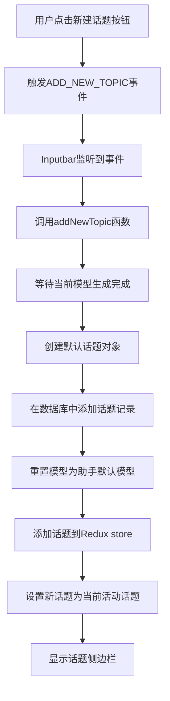

# Cherry Studio 新建话题功能实现分析

本文档详细分析 Cherry Studio 中新建话题功能的实现过程，包括从用户界面交互到数据持久化的完整流程。

## 1. 功能概述

新建话题功能允许用户在当前助手中创建一个新的对话话题（Topic）。每个话题包含一组独立的对话历史记录，用户可以在不同话题之间切换，实现多线程对话管理。

## 2. 用户界面交互

### 2.1 触发方式

新建话题功能可以通过以下几种方式触发：

1. 点击话题列表中的"新建话题"按钮
2. 点击聊天界面中的"新建话题"按钮
3. 通过快捷键或菜单操作

### 2.2 UI 组件

主要涉及以下 UI 组件：

- [NewTopicButton.tsx](../../../src/renderer/src/pages/home/Messages/NewTopicButton.tsx) - 聊天界面中的新建话题按钮
- [Topics.tsx](../../../src/renderer/src/pages/home/Tabs/components/Topics.tsx) - 话题列表中的新建话题按钮
- [Inputbar.tsx](../../../src/renderer/src/pages/home/Inputbar/Inputbar.tsx) - 输入栏中的新建话题功能

## 3. 实现流程

### 3.1 事件触发

当用户点击新建话题按钮时，会触发 [ADD_NEW_TOPIC](../../../src/renderer/src/services/EventService.ts#L25-L25) 事件：

```typescript
// NewTopicButton.tsx
const addNewTopic = () => {
  EventEmitter.emit(EVENT_NAMES.ADD_NEW_TOPIC)
}
```

### 3.2 事件监听与处理

在 [Inputbar.tsx](../../../src/renderer/src/pages/home/Inputbar/Inputbar.tsx) 中监听 [ADD_NEW_TOPIC](../../../src/renderer/src/services/EventService.ts#L25-L25) 事件并处理新建话题逻辑：

```typescript
useEffect(() => {
  const unsubscribe = EventEmitter.on(EVENT_NAMES.ADD_NEW_TOPIC, addNewTopic)
  return () => unsubscribe()
}, [addNewTopic])
```

### 3.3 核心实现逻辑

新建话题的核心实现逻辑在 [addNewTopic](../../../src/renderer/src/pages/home/Inputbar/Inputbar.tsx#L381-L402) 函数中：



具体实现代码如下：

```typescript
const addNewTopic = useCallback(async () => {
  await modelGenerating()

  const topic = getDefaultTopic(assistant.id)

  await db.topics.add({ id: topic.id, messages: [] })

  // Clear previous state
  // Reset to assistant default model
  assistant.defaultModel && setModel(assistant.defaultModel)

  addTopic(topic)
  setActiveTopic(topic)

  setTimeoutTimer('addNewTopic', () => EventEmitter.emit(EVENT_NAMES.SHOW_TOPIC_SIDEBAR), 0)
}, [addTopic, assistant.defaultModel, assistant.id, setActiveTopic, setModel, setTimeoutTimer])
```

## 4. 数据结构与状态管理

### 4.1 Topic 数据结构

话题（Topic）是 Cherry Studio 中的重要数据结构，定义如下：

```typescript
interface Topic {
  id: string
  assistantId: string
  name: string
  createdAt: string
  updatedAt: string
  messages: Message[]
  prompt?: string
  pinned?: boolean
  isNameManuallyEdited?: boolean
}
```

### 4.2 Redux 状态管理

话题的管理通过 Redux 进行状态管理，主要涉及 [assistants](../../../src/renderer/src/store/assistants.ts#L18-L18) slice：

```typescript
// 添加话题到助手
addTopic: (state, action: PayloadAction<{ assistantId: string; topic: Topic }>) => {
  const topic = action.payload.topic
  topic.createdAt = topic.createdAt || new Date().toISOString()
  topic.updatedAt = topic.updatedAt || new Date().toISOString()
  state.assistants = state.assistants.map((assistant) =>
    assistant.id === action.payload.assistantId
      ? {
          ...assistant,
          topics: uniqBy([topic, ...assistant.topics], 'id')
        }
      : assistant
  )
}
```

### 4.3 数据库持久化

话题数据通过 Dexie.js 进行持久化存储：

```typescript
// 在数据库中创建话题记录
await db.topics.add({ id: topic.id, messages: [] })
```

## 5. 关键技术点

### 5.1 事件驱动架构

新建话题功能采用事件驱动架构，通过 [EventEmitter](../../../src/renderer/src/services/EventService.ts#L3-L3) 进行组件间通信，实现了松耦合的设计。

### 5.2 异步处理

在创建新话题前，需要等待当前正在进行的模型生成完成：

```typescript
await modelGenerating()
```

这确保了在创建新话题时不会干扰正在进行的对话生成。

### 5.3 状态同步

新建话题时需要同步多个状态：

1. Redux store 状态更新
2. 数据库记录创建
3. UI 状态更新（当前活动话题切换）
4. 界面展示调整（显示话题侧边栏）

## 6. 与其他功能的关联

### 6.1 话题分支功能

新建话题功能与话题分支功能密切相关，都涉及创建新的话题对象：

```typescript
// 创建话题分支
const createTopicBranch = useCallback(
  (sourceTopicId: string, branchPointIndex: number, newTopic: Topic) => {
    logger.info(`Cloning messages from topic ${sourceTopicId} to new topic ${newTopic.id}`)
    return dispatch(cloneMessagesToNewTopicThunk(sourceTopicId, branchPointIndex, newTopic))
  },
  [dispatch]
)
```

### 6.2 自动重命名功能

创建新话题后，系统可能会自动为话题生成名称：

```typescript
// 触发自动重命名
autoRenameTopic(assistant, newTopic.id)
```

## 7. 总结

Cherry Studio 的新建话题功能实现了一个完整的用户操作流程：

1. 用户交互触发事件
2. 事件监听器捕获并处理事件
3. 执行核心业务逻辑（创建话题对象、数据库操作、状态更新）
4. 更新 UI 展示

该功能体现了现代前端应用的典型架构模式：
- 使用事件驱动实现组件解耦
- 结合 Redux 进行全局状态管理
- 利用 Dexie.js 实现数据持久化
- 采用函数式编程和 Hooks 进行组件开发

整体实现清晰、模块化，易于维护和扩展。
