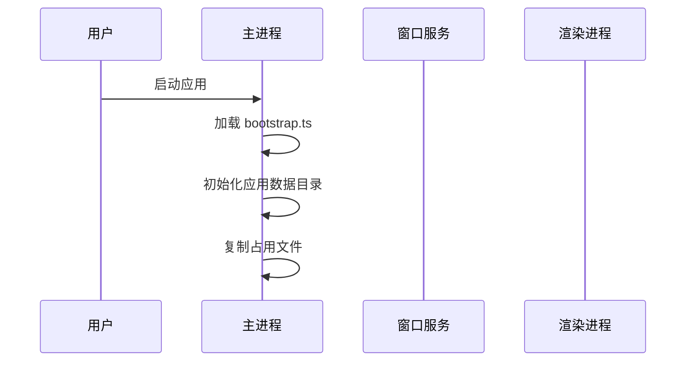
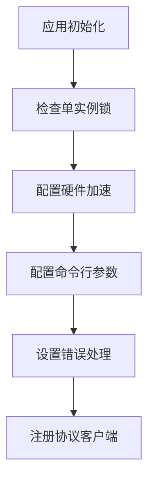
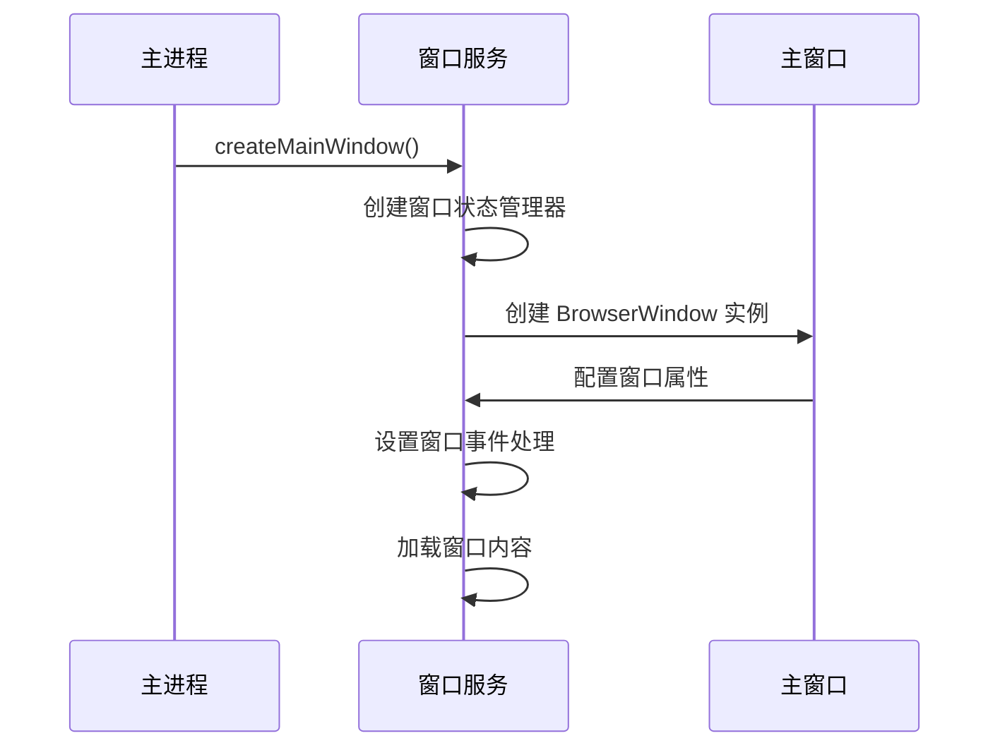
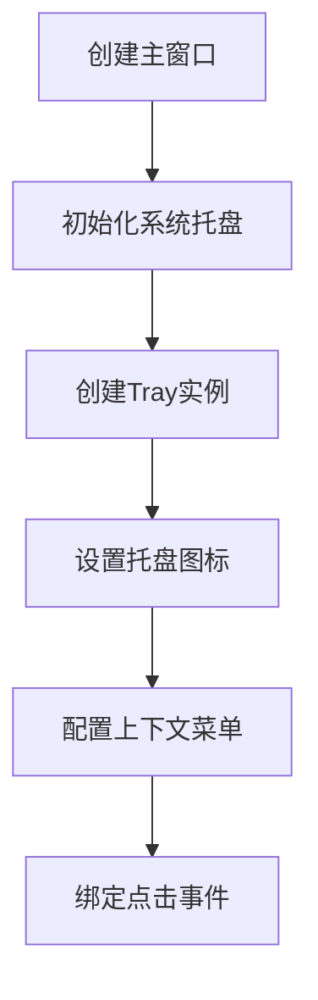
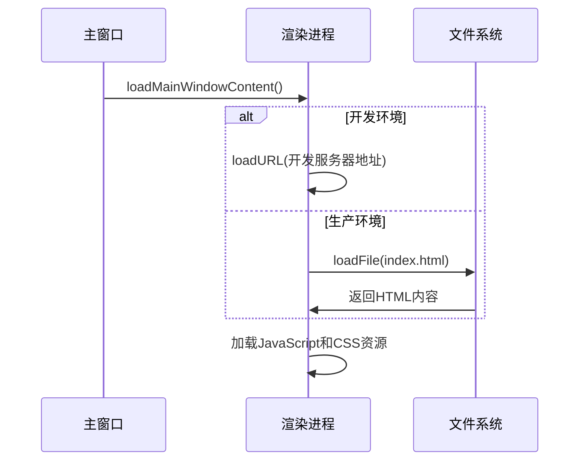
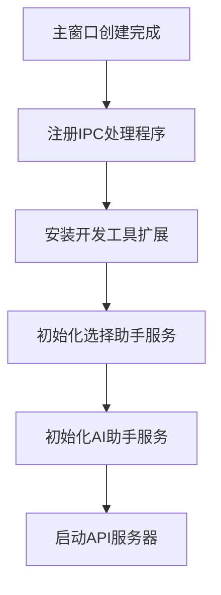
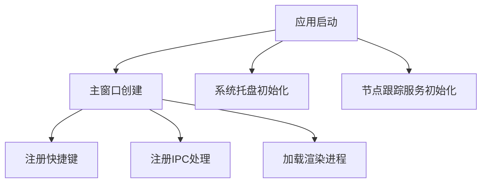
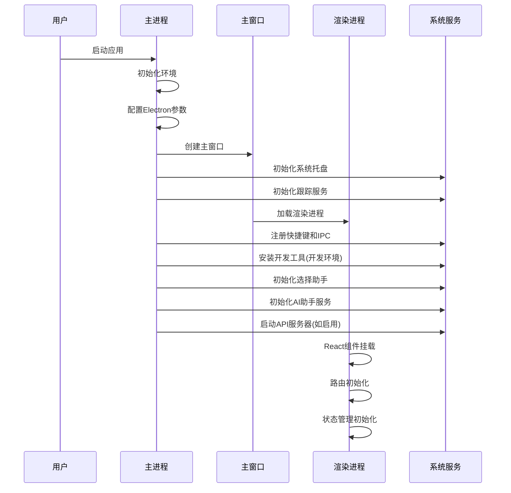

# Cherry Studio 启动场景分析

本文档详细分析 Cherry Studio 应用的启动场景实现，包括从应用启动到主窗口显示的完整流程。

## 1. 启动场景概述

Cherry Studio 的启动场景涵盖了从用户启动应用到主界面完全加载并可交互的全过程。整个启动流程包括以下几个关键阶段：

1. 应用初始化阶段
2. Electron 环境准备阶段
3. 主窗口创建阶段
4. 渲染进程加载阶段
5. 核心服务初始化阶段

## 2. 启动流程详解

### 2.1 应用初始化阶段

启动过程从 [src/main/index.ts](../../../src/main/index.ts) 文件开始，这是 Electron 主进程的入口点。

在这一阶段，系统首先加载 [bootstrap.ts](../../../src/main/bootstrap.ts) 文件，完成应用数据目录的初始化工作。如果应用被打包，会调用 [initAppDataDir()](../../../src/main/utils/init.ts#L3-L24) 函数初始化应用数据目录，并复制某些一直被占用的文件到新的应用数据目录中。

### 2.2 Electron 环境准备阶段

在主进程初始化完成后，开始配置 Electron 环境：

关键配置包括：
- 检查单实例锁，防止应用重复启动
- 根据配置禁用硬件加速
- 配置特定平台的命令行参数（如 Windows 窗口动画、Linux Wayland 支持等）
- 设置全局错误处理机制（未捕获异常和未处理拒绝）
- 注册协议客户端，支持自定义协议链接

### 2.3 主窗口创建阶段

当 Electron 环境准备就绪后，应用进入主窗口创建阶段：

主窗口创建的关键步骤：
1. 使用 [windowStateKeeper](../../../node_modules/.pnpm/electron-window-state@5.0.3/node_modules/electron-window-state/index.js#L144-L271) 管理窗口状态（位置、大小等）
2. 创建 [BrowserWindow](../../../node_modules/.pnpm/electron@37.6.0/node_modules/electron/electron.d.ts#L3048-L5787) 实例，根据平台设置不同的窗口属性（如 Mac 使用原生标题栏，Windows/Linux 使用无边框窗口）
3. 设置窗口的 WebPreferences（预加载脚本、沙箱设置等）
4. 配置窗口的各种事件处理程序

### 2.4 系统托盘初始化

在主窗口创建后，系统会初始化系统托盘服务：

### 2.5 渲染进程加载阶段

主窗口创建完成后，开始加载渲染进程内容：

渲染进程加载过程：
1. 判断是否为开发环境，如果是则从开发服务器加载，否则从本地文件加载
2. 加载 [index.html](../../../src/renderer/index.html) 文件作为入口点
3. 执行 HTML 中引用的 JavaScript 文件，包括：
   - [init.ts](../../../src/renderer/src/init.ts)：初始化应用配置
   - [entryPoint.tsx](../../../src/renderer/src/entryPoint.tsx)：React 应用入口

### 2.6 核心服务初始化阶段

在主窗口显示前后，系统会初始化各种核心服务：

核心服务初始化包括：
1. 注册 IPC 处理程序，用于主进程和渲染进程间通信
2. 在开发环境中安装 Redux 和 React 开发者工具
3. 初始化选择助手服务（SelectionService）
4. 初始化 AI 助手服务（AgentService）
5. 根据配置启动内置 API 服务器

## 3. 启动优化策略

### 3.1 并行初始化

Cherry Studio 采用了并行初始化策略，在创建主窗口的同时进行其他服务的初始化准备工作：

### 3.2 延迟加载

部分服务采用延迟加载策略，只在需要时才进行初始化：
- 选择助手窗口预加载但隐藏
- 部分配置项在首次使用时才加载

### 3.3 错误恢复机制

启动过程中实现了完善的错误处理和恢复机制：
- 渲染进程崩溃时自动重启
- 核心服务初始化失败时记录日志但不影响主流程
- 提供详细的错误日志便于问题排查

## 4. 启动时序图

完整的启动时序图如下：

## 5. 总结

Cherry Studio 的启动场景设计体现了现代 Electron 应用的最佳实践：

1. **模块化设计**：各个功能模块职责清晰，便于维护和扩展
2. **错误处理**：完善的错误处理机制确保应用稳定性
3. **性能优化**：并行初始化和延迟加载提升启动速度
4. **跨平台兼容**：针对不同平台的特殊处理确保一致体验
5. **可配置性**：通过配置管理器实现灵活的功能开关

整个启动流程从用户点击应用图标到界面完全可交互，通常在数秒内完成，为用户提供了流畅的使用体验。
